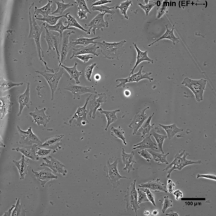

# Mask R-CNN for Object Detection and Segmentation

This is an implementation of [Mask R-CNN](https://arxiv.org/abs/1703.06870) on Python 3, Keras, and TensorFlow. The model generates bounding boxes and segmentation masks for each instance of an object in the image. It's based on Feature Pyramid Network (FPN) and a ResNet101 backbone.


The repository includes:
* Source code of Mask R-CNN built on FPN and ResNet101.
* Training code for MS COCO
* Pre-trained weights for MS COCO
* Jupyter notebooks to visualize the detection pipeline at every step
* ParallelModel class for multi-GPU training
* Evaluation on MS COCO metrics (AP)
* Example of training on your own dataset


The code is documented and designed to be easy to extend. If you use it in your research, please consider citing this repository (bibtex below). If you work on 3D vision, you might find our recently released [Matterport3D](https://matterport.com/blog/2017/09/20/announcing-matterport3d-research-dataset/) dataset useful as well.
This dataset was created from 3D-reconstructed spaces captured by our customers who agreed to make them publicly available for academic use. You can see more examples [here](https://matterport.com/gallery/).

# Getting Started
* [demo.ipynb](samples/demo.ipynb) Is the easiest way to start. It shows an example of using a model pre-trained on MS COCO to segment objects in your own images.
It includes code to run object detection and instance segmentation on arbitrary images.

* [train_shapes.ipynb](samples/shapes/train_shapes.ipynb) shows how to train Mask R-CNN on your own dataset. This notebook introduces a toy dataset (Shapes) to demonstrate training on a new dataset.

* ([model.py](mrcnn/model.py), [utils.py](mrcnn/utils.py), [config.py](mrcnn/config.py)): These files contain the main Mask RCNN implementation. 


* [inspect_data.ipynb](samples/coco/inspect_data.ipynb). This notebook visualizes the different pre-processing steps
to prepare the training data.

* [inspect_model.ipynb](samples/coco/inspect_model.ipynb) This notebook goes in depth into the steps performed to detect and segment objects. It provides visualizations of every step of the pipeline.

* [inspect_weights.ipynb](samples/coco/inspect_weights.ipynb)
This notebooks inspects the weights of a trained model and looks for anomalies and odd patterns.


# Step by Step Detection
To help with debugging and understanding the model, there are 3 notebooks 
([inspect_data.ipynb](samples/coco/inspect_data.ipynb), [inspect_model.ipynb](samples/coco/inspect_model.ipynb),
[inspect_weights.ipynb](samples/coco/inspect_weights.ipynb)) that provide a lot of visualizations and allow running the model step by step to inspect the output at each point. Here are a few examples:


## 1. Anchor sorting and filtering
Visualizes every step of the first stage Region Proposal Network and displays positive and negative anchors along with anchor box refinement.


## 2. Bounding Box Refinement
This is an example of final detection boxes (dotted lines) and the refinement applied to them (solid lines) in the second stage.


## 3. Mask Generation
Examples of generated masks. These then get scaled and placed on the image in the right location.


## 4.Layer activations
Often it's useful to inspect the activations at different layers to look for signs of trouble (all zeros or random noise).


## 5. Weight Histograms
Another useful debugging tool is to inspect the weight histograms. These are included in the inspect_weights.ipynb notebook.


## 6. Logging to TensorBoard
TensorBoard is another great debugging and visualization tool. The model is configured to log losses and save weights at the end of every epoch.


## 6. Composing the different pieces into a final result


# Training on MS COCO
We're providing pre-trained weights for MS COCO to make it easier to start. You can
use those weights as a starting point to train your own variation on the network.
Training and evaluation code is in `samples/coco/coco.py`. You can import this
module in Jupyter notebook (see the provided notebooks for examples) or you
can run it directly from the command line as such:

```
# Train a new model starting from pre-trained COCO weights
python3 samples/coco/coco.py train --dataset=/path/to/coco/ --model=coco

# Train a new model starting from ImageNet weights
python3 samples/coco/coco.py train --dataset=/path/to/coco/ --model=imagenet

# Continue training a model that you had trained earlier
python3 samples/coco/coco.py train --dataset=/path/to/coco/ --model=/path/to/weights.h5

# Continue training the last model you trained. This will find
# the last trained weights in the model directory.
python3 samples/coco/coco.py train --dataset=/path/to/coco/ --model=last
```

You can also run the COCO evaluation code with:
```
# Run COCO evaluation on the last trained model
python3 samples/coco/coco.py evaluate --dataset=/path/to/coco/ --model=last
```

The training schedule, learning rate, and other parameters should be set in `samples/coco/coco.py`.


# Training on Your Own Dataset

Start by reading this [blog post about the balloon color splash sample](https://engineering.matterport.com/splash-of-color-instance-segmentation-with-mask-r-cnn-and-tensorflow-7c761e238b46). It covers the process starting from annotating images to training to using the results in a sample application.

In summary, to train the model on your own dataset you'll need to extend two classes:

```Config```
This class contains the default configuration. Subclass it and modify the attributes you need to change.

```Dataset```
This class provides a consistent way to work with any dataset. 
It allows you to use new datasets for training without having to change 
the code of the model. It also supports loading multiple datasets at the
same time, which is useful if the objects you want to detect are not 
all available in one dataset. 

See examples in `samples/shapes/train_shapes.ipynb`, `samples/coco/coco.py`, `samples/balloon/balloon.py`, and `samples/nucleus/nucleus.py`.

## Differences from the Official Paper
This implementation follows the Mask RCNN paper for the most part, but there are a few cases where we deviated in favor of code simplicity and generalization. These are some of the differences we're aware of. If you encounter other differences, please do let us know.

* **Image Resizing:** To support training multiple images per batch we resize all images to the same size. For example, 1024x1024px on MS COCO. We preserve the aspect ratio, so if an image is not square we pad it with zeros. In the paper the resizing is done such that the smallest side is 800px and the largest is trimmed at 1000px.
* **Bounding Boxes**: Some datasets provide bounding boxes and some provide masks only. To support training on multiple datasets we opted to ignore the bounding boxes that come with the dataset and generate them on the fly instead. We pick the smallest box that encapsulates all the pixels of the mask as the bounding box. This simplifies the implementation and also makes it easy to apply image augmentations that would otherwise be harder to apply to bounding boxes, such as image rotation.

    To validate this approach, we compared our computed bounding boxes to those provided by the COCO dataset.
We found that ~2% of bounding boxes differed by 1px or more, ~0.05% differed by 5px or more, 
and only 0.01% differed by 10px or more.

* **Learning Rate:** The paper uses a learning rate of 0.02, but we found that to be
too high, and often causes the weights to explode, especially when using a small batch
size. It might be related to differences between how Caffe and TensorFlow compute 
gradients (sum vs mean across batches and GPUs). Or, maybe the official model uses gradient
clipping to avoid this issue. We do use gradient clipping, but don't set it too aggressively.
We found that smaller learning rates converge faster anyway so we go with that.

## Citation
Use this bibtex to cite this repository:
```
@misc{matterport_maskrcnn_2017,
  title={Mask R-CNN for object detection and instance segmentation on Keras and TensorFlow},
  author={Waleed Abdulla},
  year={2017},
  publisher={Github},
  journal={GitHub repository},
  howpublished={\url{https://github.com/matterport/Mask_RCNN}},
}
```

## Contributing
Contributions to this repository are welcome. Examples of things you can contribute:
* Speed Improvements. Like re-writing some Python code in TensorFlow or Cython.
* Training on other datasets.
* Accuracy Improvements.
* Visualizations and examples.

You can also [join our team](https://matterport.com/careers/) and help us build even more projects like this one.

## Requirements
Python 3.4, TensorFlow 1.3, Keras 2.0.8 and other common packages listed in `requirements.txt`.

### MS COCO Requirements:
To train or test on MS COCO, you'll also need:
* pycocotools (installation instructions below)
* [MS COCO Dataset](http://cocodataset.org/#home)
* Download the 5K [minival](https://dl.dropboxusercontent.com/s/o43o90bna78omob/instances_minival2014.json.zip?dl=0)
  and the 35K [validation-minus-minival](https://dl.dropboxusercontent.com/s/s3tw5zcg7395368/instances_valminusminival2014.json.zip?dl=0)
  subsets. More details in the original [Faster R-CNN implementation](https://github.com/rbgirshick/py-faster-rcnn/blob/master/data/README.md).

If you use Docker, the code has been verified to work on
[this Docker container](https://hub.docker.com/r/waleedka/modern-deep-learning/).


## Installation
1. Clone this repository
2. Install dependencies
   ```bash
   pip3 install -r requirements.txt
   ```
3. Run setup from the repository root directory
    ```bash
    python3 setup.py install
    ``` 
3. Download pre-trained COCO weights (mask_rcnn_coco.h5) from the [releases page](https://github.com/matterport/Mask_RCNN/releases).
4. (Optional) To train or test on MS COCO install `pycocotools` from one of these repos. They are forks of the original pycocotools with fixes for Python3 and Windows (the official repo doesn't seem to be active anymore).

    * Linux: https://github.com/waleedka/coco
    * Windows: https://github.com/philferriere/cocoapi.
    You must have the Visual C++ 2015 build tools on your path (see the repo for additional details)

# Projects Using this Model
If you extend this model to other datasets or build projects that use it, we'd love to hear from you.

### [4K Video Demo](https://www.youtube.com/watch?v=OOT3UIXZztE) by Karol Majek.
[](https://www.youtube.com/watch?v=OOT3UIXZztE)

### [Images to OSM](https://github.com/jremillard/images-to-osm): Improve OpenStreetMap by adding baseball, soccer, tennis, football, and basketball fields.


### [Splash of Color](https://engineering.matterport.com/splash-of-color-instance-segmentation-with-mask-r-cnn-and-tensorflow-7c761e238b46). A blog post explaining how to train this model from scratch and use it to implement a color splash effect.


### [Segmenting Nuclei in Microscopy Images](samples/nucleus). Built for the [2018 Data Science Bowl](https://www.kaggle.com/c/data-science-bowl-2018)
Code is in the `samples/nucleus` directory.


### [Detection and Segmentation for Surgery Robots](https://github.com/SUYEgit/Surgery-Robot-Detection-Segmentation) by the NUS Control & Mechatronics Lab.


### [Reconstructing 3D buildings from aerial LiDAR](https://medium.com/geoai/reconstructing-3d-buildings-from-aerial-lidar-with-ai-details-6a81cb3079c0)
A proof of concept project by [Esri](https://www.esri.com/), in collaboration with Nvidia and Miami-Dade County. Along with a great write up and code by Dmitry Kudinov, Daniel Hedges, and Omar Maher.


### [Usiigaci: Label-free Cell Tracking in Phase Contrast Microscopy](https://github.com/oist/usiigaci)
A project from Japan to automatically track cells in a microfluidics platform. Paper is pending, but the source code is released.

 

### [Characterization of Arctic Ice-Wedge Polygons in Very High Spatial Resolution Aerial Imagery](http://www.mdpi.com/2072-4292/10/9/1487)
Research project to understand the complex processes between degradations in the Arctic and climate change. By Weixing Zhang, Chandi Witharana, Anna Liljedahl, and Mikhail Kanevskiy.


### [Mask-RCNN Shiny](https://github.com/huuuuusy/Mask-RCNN-Shiny)
A computer vision class project by HU Shiyu to apply the color pop effect on people with beautiful results.


### [Mapping Challenge](https://github.com/crowdAI/crowdai-mapping-challenge-mask-rcnn): Convert satellite imagery to maps for use by humanitarian organisations.


### [GRASS GIS Addon](https://github.com/ctu-geoforall-lab/i.ann.maskrcnn) to generate vector masks from geospatial imagery. Based on a [Master's thesis](https://github.com/ctu-geoforall-lab-projects/dp-pesek-2018) by Ondřej Pešek.


# Mask R-CNN Rehberi

Bu rehber, RTX ekran kartı bulunan bir bilgisayarda Mask R-CNN kurulumunu ve çalıştırılmasını adım adım anlatmaktadır. Rehberde gerekli aracılar, ortam kurulumu ve COCO API kurulumu detaylı bir şekilde ele alınmıştır.

---

## Gereklilikleri İndirme ve Kurma

Mask R-CNN'ı başarıyla çalıştırmak için aşağıdaki adımları sırasıyla takip edin. Öncelikli olarak ek yazılım ve dosyaları yükleyerek ortamı hazırlamalısınız.

### 1. Anaconda’yı Yükleyin

**Neden gerekli?** Python ortamını yönetmek ve izole projeler oluşturmak için kullanılır.

**Nasıl indirilir?** [Anaconda Download](https://www.anaconda.com/download/success)

Kurulumdan sonra Anaconda'yı sistem PATH değişkenine eklediğinizden emin olun. [Detaylı rehber](https://www.geeksforgeeks.org/how-to-setup-anaconda-path-to-environment-variable/)

### 2. Git'i Yükleyin

**Neden gerekli?** Kod depolarını klonlamak ve sürüm kontrolü yapmak için kullanılır.

**Nasıl indirilir?** [Git Download](https://git-scm.com/downloads)

### 3. Python ve Pip'i Yükleyin

**Neden gerekli?** Projenin çalışması için temel yazılım dili ve paket yöneticisidir.

**Nasıl indirilir?** [Python Download](https://www.python.org/downloads/)

### 4. Microsoft 2015 Build Tools'u Yükleyin

**Neden gerekli?** TensorFlow ve bazı Python paketleri C++ kodlarını derlemek için bu aracı kullanır.

**Nasıl indirilir?** [Build Tools Download](https://www.microsoft.com/en-us/download/details.aspx?id=48159)

### 5. Rustup'u Yükleyin

**Neden gerekli?** Mask R-CNN’in bazı bağımlılıkları Rust dilinde yazılmıştır. Rustup, Rust dilinin kolayca yüklenmesini sağlar.

**Nasıl indirilir?** [Rust Install](https://www.rust-lang.org/tools/install)

### 6. CUDA 11.2 ve cuDNN 8.1.0ı Yükleyin

**Neden gerekli?** TensorFlow, NVIDIA CUDA platformu üzerinde hesaplama yaparak GPU'dan yararlanır. CUDA, NVIDIA ekran kartlarının performansını optimize ederken, cuDNN derin öğrenme için gerekli temel kütüphaneleri sunar.

**Nasıl indirilir?**

- [CUDA 11.2 Download](https://developer.nvidia.com/cuda-downloads)
- [cuDNN 8.1.0 Download](https://developer.nvidia.com/rdp/cudnn-archive)

### 7. C++ Build Tools'u Yükleyin

**Neden gerekli?** Mask R-CNN'in derleme işlemleri için gerekli olan temel bileşendir.

**Nasıl indirilir?** [Visual Studio Build Tools](https://visualstudio.microsoft.com/tr/downloads/?q=build+tools)

### 8. Mask R-CNN Kod Deposu

**Neden gerekli?** Mask R-CNN'in kodları ve yapısı proje içerisinde kullanılır.

**Nasıl indirilir?**
Aşağıdaki komutu terminalde çalıştırın:

```bash
git clone https://github.com/leekunhee/Mask_RCNN.git
```

**Not:** Bu işlemi yapmadan önce, terminal veya komut istemcisinde Mask R-CNN klasörünü oluşturmak istediğiniz dizine gidin. Örneğin:

```bash
cd C:\Users\KullanıcıAdı\ProjeKlasörü
```

Bu komut sizi belirtilen klasöre taşır ve dosyalar buraya indirilecektir.

### 9. mask_rcnn_coco.h5 Dosyası

**Neden gerekli?** Mask R-CNN’in COCO veri setiyle önceden eğitilmiş ağını kullanabilmesi için bu dosyaya ihtiyacı vardır.

**Nasıl indirilir?** [mask_rcnn_coco.h5 Download](https://github.com/matterport/Mask_RCNN/releases)

**Not:** Bu dosyayı indirdikten sonra, `Mask_RCNN` klasörünün içine yerleştirin.

---

## Ortam Kurulumu

1. **Anaconda Çevresi Oluştur**

   ```bash
   conda create -n MaskR python=3.8
   ```
   **Neden gerekli?** Python paketlerinizi izole bir ortamda yönetmek için Anaconda kullanılır. Bu, sistem dosyalarına zarar vermeden belirli bir proje için ihtiyaç duyulan paketlerin kurulumunu sağlar.

2. **conda init Komutunu Çalıştırın**

   ```bash
   conda init
   ```
   **Neden gerekli?** Bu komut, Conda’nın komut istemcisi entegrasyonunu etkinleştirir. Böylece terminalde Conda komutlarını sorunsuz bir şekilde çalıştırabilirsiniz.

3. **Komut İstemcisini Kapatıp Yeniden Açın**
   `conda init` komutundan sonra terminali kapatıp yeniden açın. Bu işlem, ortam değişikliklerinin etkinleşmesini sağlar.

4. **conda activate Komutunu Kullanarak Ortamı Aktif Hale Getirin**

   ```bash
   conda activate MaskR
   ```
   **Neden gerekli?** Belirli bir projeye ait paketlerin kullanılabilmesi için oluşturulan Anaconda ortamının aktif hale getirilmesi gerekir. Bu komut, sizi `MaskR` ortamına geçirir.

5. **Gerekli Python Paketlerini Yükle**

   ```bash
   pip install tensorflow==2.3.0
   pip install protobuf==3.20.3
   pip install opencv-python==4.3.0.38
   ```
   **Neden gerekli?** TensorFlow, Protobuf ve OpenCV gibi kütüpaneler Mask R-CNN'in çalışması için temel bileşenlerdir.

6. **requirements.txt Dosyasını Düzenle**
   Aşağıdaki içeriği ekleyin:

   ```
   numpy==1.18.5
   scipy==1.4.1
   Pillow==10.4.0
   keras==2.15.0
   cython==0.29.21
   matplotlib==3.2.2
   scikit-image==0.19.3
   h5py==2.10.0
   imgaug==0.4.0
   IPython==7.34.0
   ```

   **Neden gerekli?** Bu paketler, Mask R-CNN'in çalışması için gerekli olan bilimsel hesaplama ve görüntü işleme kütüpaneleridir.

7. **Paketleri Yükle**

   ```bash
   pip install -r requirements.txt
   ```

---

## COCO API Kurulumu

1. **COCO API Deposu Klonla**

   ```bash
   git clone https://github.com/philferriere/cocoapi.git
   ```

   **Not:** Bu komutu çalıştırmadan önce, Mask R-CNN kodlarını indirdiğiniz klasörün içinde olduğunuzdan emin olun. Örneğin:

   ```bash
   cd C:\Users\KullanıcıAdı\ProjeKlasörü\Mask_RCNN
   ```

   Böylece COCO API dosyaları `Mask_RCNN` klasörünün içine indirilecektir.

2. **Python API’yi Yükle**

   ```bash
   pip install git+https://github.com/philferriere/cocoapi.git#subdirectory=PythonAPI
   ```

---

## CUDA ve cuDNN Kurulumu

Conda ortamında CUDA ve cuDNN yükle:

```bash
conda install -c conda-forge cudatoolkit=11.2 cudnn=8.1.0
```

**Neden gerekli?** CUDA ve cuDNN, GPU tabanlı hesaplamaları optimize ederek TensorFlow'un daha hızlı çalışmasını sağlar.

---

## Deneme Aşaması

1. **Jupyter Notebook’u Başlatın**

   Terminalde aşağıdaki komutu çalıştırarak Jupyter Notebook’u başlatın:

   ```bash
   jupyter notebook
   ```

2. **samples Klasörüne Girin**

   Açılan Jupyter arayüzünde `Mask_RCNN` klasörünün içindeki `samples` klasörüne girin. Burada çeşitli örnek projeler bulacaksınız.

3. **Demo Notebook’u Açın**

   `samples` klasöründe bulunan demo notebook dosyasını (`demo.ipynb`) açın. Bu dosya, Mask R-CNN’i test etmek için örnek bir çalıştırma sunar.

4. **Kod Satırlarını Çalıştırın**

   Jupyter Notebook’ta her bir hücreyi sırayla çalıştırmak için:

   - Hücreyi seçin ve `Shift + Enter` tuşlarına basın.
   - Kod başarıyla çalıştırıldığında, hücrenin solundaki `[*]` işareti bir sayı ile değişecektir (örneğin `[1]`).

   **Not:** Eğer bir hata alırsanız, hata mesajını dikkatlice okuyarak eksik veya yanlış bir adım olup olmadığını kontrol edin.

---

Bu adımları izledikten sonra Mask R-CNN’in kurulumunun doğru çalıştığını test edebilirsiniz. Jupyter Notebook’ta modelin sonuçlarını görselleştirebilir ve kendi veri setlerinizle denemeler yapabilirsiniz. 🚀

