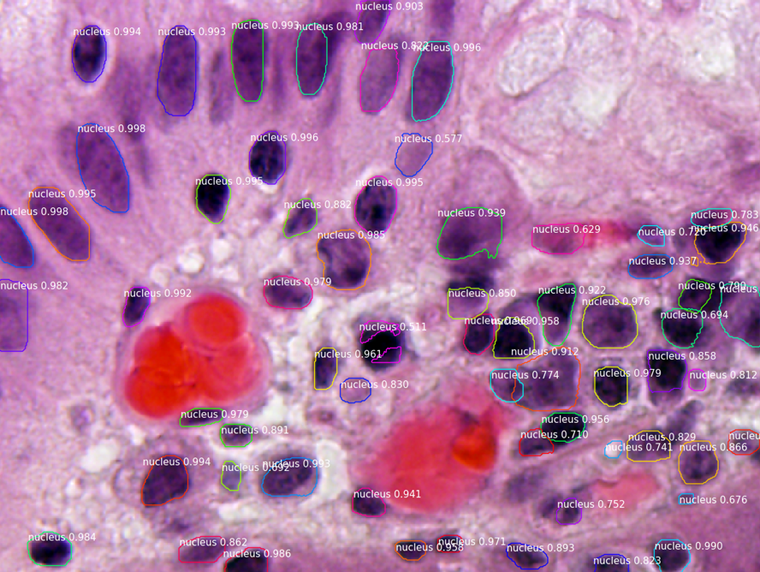
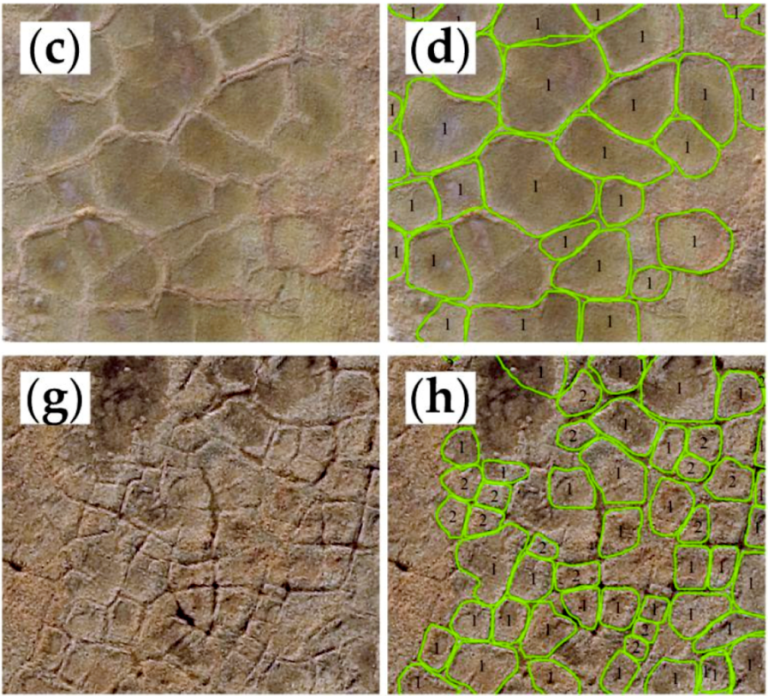

# Mask R-CNN: Nesne Tespiti ve Segmentasyon Rehberi

Mask R-CNN, nesne tespiti ve segmentasyon problemleri üzerine geliştirilmiş, ResNet101 ve Özellik Piramit Ağı (FPN) tabanlı bir derin öğrenme modelidir. 
Bu rehberde, Mask R-CNN'in ana bileşenleri ve uygulama alanları üzerine detaylı bilgi verilecektir.


## Özellikler
Mask R-CNN, bir görüntüdeki her nesneyi tespit eder ve bu nesnelerin her biri için bir segmentasyon maskesi oluşturur. 
Bu yeteneği sayesinde, Mask R-CNN şu alanlarda yoğun olarak kullanılır:

- Otonom Araçlar: Nesne tespiti ve ayrıştırma.
- Medikal Görüntüleme: Organ ve lezyon segmentasyonu.
- Uydu Görüntüleme: Coğrafi nesne analizi.
- Sanat ve Tasarım: Nesne ayırımı ve renk manipülasyonu.

## Temel Bileşenler

1. **FPN ve ResNet101**: Modelin omurgası olarak görev yapar, çoklu çözünürlükte özellik haritaları üretir.

2. **ROIAlign**: Her bir nesne için kesin bir maske oluşturmak üzere bölge tekliflerini hassas bir şekilde hizalar.

3. **Maskeleri ve Sınır Kutu Tahmini**: Her bir nesne için segmentasyon maskeleri ve sınır kutuları oluşturur.

## Mask R-CNN'ın Avantajları

- **Modüler Yapı**: Kolayca özelleştirilebilir ve genişletilebilir.
- **Yüksek Doğruluk**: COCO benchmark’ında başarılı performans.
- **Çoklu Nesne ve Sınıf Desteği**: Bir görüntüdeki birden fazla nesneyi ve sınıfı kolayca tespit edebilir.

## Adım Adım Tespit Süreci

1. **Ankraj Sıralaması ve Filtreleme**: İlk aşama Bölge Öneri Ağı'nın her adımını görselleştirir ve pozitif ve negatif ankrajları, ayrıca ankraj kutusu iyileştirmelerini gösterir.

    

2. **Sınır Kutu İyileştirme**: İkinci aşamadaki son tespit kutularının (noktalı çizgiler) ve bunlara uygulanan iyileştirmenin (düz çizgiler) bir örneğidir.

    

3. **Maske Üretimi**: Oluşturulan maskelerden örnekler. Daha sonra bu maskeler ölçeklendirilip görüntüde doğru konuma yerleştirilir.

    

4. **Katman Aktivasyonları**: Sorun işaretleri (tümü sıfır veya rastgele gürültü gibi) için farklı katmanlardaki aktivasyonları incelemek genellikle faydalıdır.

    

5. **Ağırlık Histogramları**: Başka bir faydalı hata ayıklama aracı, ağırlık histogramlarını incelemektir. 

    

6. **TensorBoard'a Kayıt**: TensorBoard, başka bir harika hata ayıklama ve görselleştirme aracıdır. Model, her dönemin sonunda kayıpları kaydetmek ve ağırlıkları kaydetmek üzere yapılandırılmıştır.

    

7. **Sonuçların Birleştirilmesi**: Farklı parçalar birleştirilerek nihai sonuç oluşturulur.

    

## Uygulama Alanlarından Örnekler


### [4K Video Demo](https://www.youtube.com/watch?v=OOT3UIXZztE) by Karol Majek
[](https://www.youtube.com/watch?v=OOT3UIXZztE)

### [Images to OSM](https://github.com/jremillard/images-to-osm): Beyzbol, futbol, tenis gibi spor sahalarını OpenStreetMap'e ekleyin.


### [Renk Sıçraması](https://engineering.matterport.com/splash-of-color-instance-segmentation-with-mask-r-cnn-and-tensorflow-7c761e238b46): Renk vurgulama efekti için Mask R-CNN ile örnek bir uygulama.


### [Mikroskopik Çekirdek Segmentasyonu](samples/nucleus): [2018 Data Science Bowl](https://www.kaggle.com/c/data-science-bowl-2018) için geliştirilmiştir.
Kodlar `samples/nucleus` dizinindedir.



### [Cerrahi Robotlar için Tespit ve Segmentasyon](https://github.com/SUYEgit/Surgery-Robot-Detection-Segmentation): NUS Kontrol ve Mekatronik Laboratuvarı tarafından geliştirilmiştir.


### [Havadan LiDAR ile 3D Bina Yeniden Yapılandırma](https://medium.com/geoai/reconstructing-3d-buildings-from-aerial-lidar-with-ai-details-6a81cb3079c0)
Esri, Nvidia ve Miami-Dade County işbirliği ile bir kanıt projesi. Yazı ve kod Dmitry Kudinov, Daniel Hedges ve Omar Maher tarafından.


### [Usiigaci: Farksız Çekirdek Takibi](https://github.com/oist/usiigaci)
Japonya'dan bir projedir. Mikroakışkan platformlarındaki hücreleri otomatik izler. Yayın beklemede, ancak kaynak kodu paylaşılmıştır.

 

### [Arktik Buz Kama Poligonlarının Karakterizasyonu](http://www.mdpi.com/2072-4292/10/9/1487)
Arktik bozulmalar ile iklim değişikliği arasındaki karmaşık süreçleri anlamak için bir araştırma projesi.


### [Mask-RCNN Shiny](https://github.com/huuuuusy/Mask-RCNN-Shiny): Renk vurgusu efekti ile insanları öne çıkaran bir bilgisayarlı görüş projeleri.


### [Haritalama Yarışması](https://github.com/crowdAI/crowdai-mapping-challenge-mask-rcnn): Uydu görüntülerinden haritalar oluşturarak insani yardım organizasyonlarına destek verin.


### [GRASS GIS Eklentisi](https://github.com/ctu-geoforall-lab/i.ann.maskrcnn): Coğrafi görüntülerden vektör maskeleri oluşturmak için bir GRASS GIS eklentisi. 
Ondřej Pešek tarafından yazılan bir [Yüksek Lisans Tezi](https://github.com/ctu-geoforall-lab-projects/dp-pesek-2018) temel alınmıştır.


## Referanslar ve Daha Fazla Bilgi

- **Orijinal Makale**: [Mask R-CNN](https://arxiv.org/abs/1703.06870)
- **Matterport3D Veri Seti**: [Matterport3D](https://matterport.com/gallery/)
- **COCO Benchmark**: [COCO Dataset](http://cocodataset.org/#home)

Mask R-CNN, araştırmacılar ve geliştiriciler için derin öğrenme tabanlı nesne tespiti ve segmentasyon problemlerinde çok yönlü bir aracıdır. Daha fazla bilgi için [Mask R-CNN GitHub](https://github.com/matterport/Mask_RCNN) sayfasına göz atabilirsiniz.


# RTX Ekran Kartına Mask R-CNN(https://github.com/leekunhee/Mask_RCNN) Kurulum ve Kullanım Rehberi

Bu rehber, RTX ekran kartı bulunan bir bilgisayarda Mask R-CNN kurulumunu ve çalıştırılmasını adım adım anlatmaktadır. Rehberde gerekli araçlar, ortam kurulumu ve COCO API kurulumu detaylı bir şekilde ele alınmıştır.

---

## Gereklilikleri İndirme ve Kurma

Mask R-CNN'ı başarıyla çalıştırmak için aşağıdaki adımları sırasıyla takip edin. Öncelikli olarak ek yazılım ve dosyaları yükleyerek ortamı hazırlamalısınız.

### 1. Anaconda’yı Yükleyin

**Neden gerekli?** Python ortamını yönetmek ve izole projeler oluşturmak için kullanılır.

**Nasıl indirilir?** [Anaconda Download](https://www.anaconda.com/download/success)

Kurulumdan sonra Anaconda'yı sistem PATH değişkenine eklediğinizden emin olun. [Detaylı rehber](https://www.geeksforgeeks.org/how-to-setup-anaconda-path-to-environment-variable/)

### 2. Git'i Yükleyin

**Neden gerekli?** Kod depolarını klonlamak ve sürüm kontrolü yapmak için kullanılır.

**Nasıl indirilir?** [Git Download](https://git-scm.com/downloads)

### 3. Python ve Pip'i Yükleyin

**Neden gerekli?** Projenin çalışması için temel yazılım dili ve paket yöneticisidir.

**Nasıl indirilir?** [Python Download](https://www.python.org/downloads/)

### 4. Microsoft 2015 Build Tools'u Yükleyin

**Neden gerekli?** TensorFlow ve bazı Python paketleri C++ kodlarını derlemek için bu aracı kullanır.

**Nasıl indirilir?** [Build Tools Download](https://www.microsoft.com/en-us/download/details.aspx?id=48159)

### 5. Rustup'u Yükleyin

**Neden gerekli?** Mask R-CNN’in bazı bağımlılıkları Rust dilinde yazılmıştır. Rustup, Rust dilinin kolayca yüklenmesini sağlar.

**Nasıl indirilir?** [Rust Install](https://www.rust-lang.org/tools/install)

### 6. CUDA 11.2 ve cuDNN 8.1.0ı Yükleyin

**Neden gerekli?** TensorFlow, NVIDIA CUDA platformu üzerinde hesaplama yaparak GPU'dan yararlanır. CUDA, NVIDIA ekran kartlarının performansını optimize ederken, cuDNN derin öğrenme için gerekli temel kütüphaneleri sunar.

**Nasıl indirilir?**

- [CUDA 11.2 Download](https://developer.nvidia.com/cuda-downloads)
- [cuDNN 8.1.0 Download](https://developer.nvidia.com/rdp/cudnn-archive)
- conda install -c conda-forge cudatoolkit=11.2 cudnn=8.1.0

### 7. C++ Build Tools'u Yükleyin

**Neden gerekli?** Mask R-CNN'in derleme işlemleri için gerekli olan temel bileşendir.

**Nasıl indirilir?** [Visual Studio Build Tools](https://visualstudio.microsoft.com/tr/downloads/?q=build+tools)

### 8. Mask R-CNN Kod Deposu

**Neden gerekli?** Mask R-CNN'in kodları ve yapısı proje içerisinde kullanılır.

**Nasıl indirilir?**
Aşağıdaki komutu terminalde çalıştırın:

```bash
git clone https://github.com/leekunhee/Mask_RCNN.git
```

**Not:** Bu işlemi yapmadan önce, terminal veya komut istemcisinde Mask R-CNN klasörünü oluşturmak istediğiniz dizine gidin. Örneğin:

```bash
cd C:\Users\KullanıcıAdı\ProjeKlasörü
```

Bu komut sizi belirtilen klasöre taşır ve dosyalar buraya indirilecektir.

### 9. mask_rcnn_coco.h5 Dosyası

**Neden gerekli?** Mask R-CNN’in COCO veri setiyle önceden eğitilmiş ağını kullanabilmesi için bu dosyaya ihtiyacı vardır.

**Nasıl indirilir?** [mask_rcnn_coco.h5 Download](https://github.com/matterport/Mask_RCNN/releases)

**Not:** Bu dosyayı indirdikten sonra, `Mask_RCNN` klasörünün içine yerleştirin.

---

## Ortam Kurulumu

1. **Anaconda Çevresi Oluştur**

   ```bash
   conda create -n MaskR python=3.8
   ```
   **Neden gerekli?** Python paketlerinizi izole bir ortamda yönetmek için Anaconda kullanılır. Bu, sistem dosyalarına zarar vermeden belirli bir proje için ihtiyaç duyulan paketlerin kurulumunu sağlar.

2. **conda init Komutunu Çalıştırın**

   ```bash
   conda init
   ```
   **Neden gerekli?** Bu komut, Conda’nın komut istemcisi entegrasyonunu etkinleştirir. Böylece terminalde Conda komutlarını sorunsuz bir şekilde çalıştırabilirsiniz.

3. **Komut İstemcisini Kapatıp Yeniden Açın**
   `conda init` komutundan sonra terminali kapatıp yeniden açın. Bu işlem, ortam değişikliklerinin etkinleşmesini sağlar.

4. **conda activate Komutunu Kullanarak Ortamı Aktif Hale Getirin**

   ```bash
   conda activate MaskR
   ```
   **Neden gerekli?** Belirli bir projeye ait paketlerin kullanılabilmesi için oluşturulan Anaconda ortamının aktif hale getirilmesi gerekir. Bu komut, sizi `MaskR` ortamına geçirir.

5. **Gerekli Python Paketlerini Yükle**

   ```bash
   pip install tensorflow==2.3.0
   pip install protobuf==3.20.3
   pip install opencv-python==4.3.0.38
   ```
   **Neden gerekli?** TensorFlow, Protobuf ve OpenCV gibi kütüpaneler Mask R-CNN'in çalışması için temel bileşenlerdir.

6. **requirements.txt Dosyasını Düzenle**
   Aşağıdaki içeriği ekleyin:

   ```
   numpy==1.18.5
   scipy==1.4.1
   Pillow==10.4.0
   keras==2.15.0
   cython==0.29.21
   matplotlib==3.2.2
   scikit-image==0.19.3
   h5py==2.10.0
   imgaug==0.4.0
   IPython==7.34.0
   ```

   **Neden gerekli?** Bu paketler, Mask R-CNN'in çalışması için gerekli olan bilimsel hesaplama ve görüntü işleme kütüpaneleridir.

7. **Paketleri Yükle**

   ```bash
   pip install -r requirements.txt
   ```

---

## COCO API Kurulumu

1. **COCO API Deposu Klonla**

   ```bash
   git clone https://github.com/philferriere/cocoapi.git
   ```

   **Not:** Bu komutu çalıştırmadan önce, Mask R-CNN kodlarını indirdiğiniz klasörün içinde olduğunuzdan emin olun. Örneğin:

   ```bash
   cd C:\Users\KullanıcıAdı\ProjeKlasörü\Mask_RCNN
   ```

   Böylece COCO API dosyaları `Mask_RCNN` klasörünün içine indirilecektir.

2. **Python API’yi Yükle**

   ```bash
   pip install git+https://github.com/philferriere/cocoapi.git#subdirectory=PythonAPI
   ```

---


## Deneme Aşaması

1. **Jupyter Notebook’u Başlatın**

   Terminalde aşağıdaki komutu çalıştırarak Jupyter Notebook’u başlatın:

   ```bash
   jupyter notebook
   ```

2. **samples Klasörüne Girin**

   Açılan Jupyter arayüzünde `Mask_RCNN` klasörünün içindeki `samples` klasörüne girin. Burada çeşitli örnek projeler bulacaksınız.

3. **Demo Notebook’u Açın**

   `samples` klasöründe bulunan demo notebook dosyasını (`demo.ipynb`) açın. Bu dosya, Mask R-CNN’i test etmek için örnek bir çalıştırma sunar.

4. **Kod Satırlarını Çalıştırın**

   Jupyter Notebook’ta her bir hücreyi sırayla çalıştırmak için:

   - Hücreyi seçin ve `Shift + Enter` tuşlarına basın.
   - Kod başarıyla çalıştırıldığında, hücrenin solundaki `[*]` işareti bir sayı ile değişecektir (örneğin `[1]`).

   **Not:** Eğer bir hata alırsanız, hata mesajını dikkatlice okuyarak eksik veya yanlış bir adım olup olmadığını kontrol edin.

---

Bu adımları izledikten sonra Mask R-CNN’in kurulumunun doğru çalıştığını test edebilirsiniz. Jupyter Notebook’ta modelin sonuçlarını görselleştirebilir ve kendi veri setlerinizle denemeler yapabilirsiniz. 🚀

## GTX Ekran Kartı için Mask R-CNN Kurulum Rehberi

Bu rehber, GTX serisi ekran kartı bulunan sistemlerde Mask R-CNN kurulumunu adım adım açıklamaktadır. Gerekli dosyaların ve yazılımların indirilmesinden başlayarak ortam kurulumu ve COCO API entegrasyonuna kadar her aşama detaylı bir şekilde anlatılmıştır.

### Maritime Mask R-CNN Nedir ve Neden Kullanıyoruz?

Maritime Mask R-CNN, standart Mask R-CNN modelinin bir varyasyonudur. Bu model, özellikle denizcilik ve ilgili alanlarda kullanılmak üzere optimize edilmiştir. Eğitim süreci ve veri seti hazırlığı, diğer modellere göre daha kolaydır, bu da kullanıcıların kısa sürede etkili sonuçlar almasını sağlar. Maritime Mask R-CNN, esneklik ve kullanım kolaylığı sunarak özellikle başlangıç seviyesindeki kullanıcılar için ideal bir çözümdür.


## Gereklilikleri İndirme ve Kurma

Mask R-CNN'ı başarıyla çalıştırmak için aşağıdaki adımları sırasıyla takip edin. Öncelikli olarak ek yazılım ve dosyaları yükleyerek ortamı hazırlamalısınız.


### 1. Anaconda’yı Yükleyin

**Neden gerekli?** Python ortamını yönetmek ve izole projeler oluşturmak için kullanılır.

**Nasıl indirilir?** [Anaconda Download](https://www.anaconda.com/download/success)

Kurulumdan sonra Anaconda'yı sistem PATH değişkenine eklediğinizden emin olun. [Detaylı rehber](https://www.geeksforgeeks.org/how-to-setup-anaconda-path-to-environment-variable/)

### 2. Git'i Yükleyin

**Neden gerekli?** Kod depolarını klonlamak ve sürüm kontrolü yapmak için kullanılır.

**Nasıl indirilir?** [Git Download](https://git-scm.com/downloads)

### 3. Python ve Pip'i Yükleyin

**Neden gerekli?** Projenin çalışması için temel yazılım dili ve paket yöneticisidir.

**Nasıl indirilir?** [Python Download](https://www.python.org/downloads/)

### 4. Microsoft 2015 Build Tools'u Yükleyin

**Neden gerekli?** TensorFlow ve bazı Python paketleri C++ kodlarını derlemek için bu aracı kullanır.

**Nasıl indirilir?** [Build Tools Download](https://www.microsoft.com/en-us/download/details.aspx?id=48159)

### 5. Rustup'u Yükleyin

**Neden gerekli?** Mask R-CNN’in bazı bağımlılıkları Rust dilinde yazılmıştır. Rustup, Rust dilinin kolayca yüklenmesini sağlar.

**Nasıl indirilir?** [Rust Install](https://www.rust-lang.org/tools/install)

### 6. CUDA 9.0 ve cuDNN 7.0.5’i Yükleyin

**Neden gerekli?** TensorFlow, NVIDIA CUDA platformu üzerinde hesaplama yaparak GPU'dan yararlanır. CUDA, NVIDIA ekran kartlarının performansını optimize ederken, cuDNN derin öğrenme için gerekli temel kütüphaneleri sunar.

**Nasıl indirilir?**

- [CUDA 9.0 Download](https://developer.nvidia.com/cuda-90-download-archive)
- [cuDNN 7.0.5 Download](https://developer.nvidia.com/rdp/cudnn-archive)

### 7. C++ Build Tools'u Yükleyin

**Neden gerekli?** Mask R-CNN'in derleme işlemleri için gerekli olan temel bileşendir.

**Nasıl indirilir?** [Visual Studio Build Tools](https://visualstudio.microsoft.com/tr/downloads/?q=build+tools)

### 8. Maritme Mask R-CNN Kod Deposu

**Neden gerekli?** Maritme Mask R-CNN kodları ve yapısı proje içerisinde kullanılır.

**Nasıl indirilir?**
Aşağıdaki komutu terminalde çalıştırın:

```bash
git clone https://github.com/Allopart/Maritme_Mask_RCNN.git
```

**Not:** Bu işlemi yapmadan önce, terminal veya komut istemcisinde Maritme Mask R-CNN klasörünü oluşturmak istediğiniz dizine gidin. Örneğin:

```bash
cd C:\Users\KullanıcıAdı\ProjeKlasörü
```

Bu komut sizi belirtilen klasöre taşır ve dosyalar buraya indirilecektir.

### 9. mask_rcnn_coco.h5 Dosyası

**Neden gerekli?** Mask R-CNN’in COCO veri setiyle önceden eğitilmiş ağını kullanabilmesi için bu dosyaya ihtiyacı vardır.

**Nasıl indirilir?** [mask_rcnn_coco.h5 Download](https://github.com/matterport/Mask_RCNN/releases)

**Not:** Bu dosyayı indirdikten sonra, `Maritme_Mask_RCNN` klasörünün içine yerleştirin.

---

## Ortam Kurulumu

Kurulum için gerekli Python ortamını oluşturup kütüphaneleri yükleyin:

### 1. Anaconda Ortamı Oluşturun

```bash
conda create -n MaskR python=3.6
```

**Neden gerekli?** İzole bir Python 3.6 ortamı oluşturur.

### 2. Anaconda Ortamını Aktif Hale Getirin

```bash
conda init
```

Bu komuttan sonra terminali kapatıp yeniden açın ve aşağıdaki komutla ortamı aktif hale getirin:

```bash
conda activate MaskR
```

### 3. TensorFlow ve Diğer Gerekli Kütüphaneleri Yükleyin

```bash
pip install tensorflow-gpu==1.5
pip install opencv-python==4.3.0.36
pip install keras==2.1.5
pip install h5py==2.10.0
```

### 4. Ek Kütüphaneleri Yükleyin

```bash
pip install -r requirements.txt
```

**Not:** TensorFlow, OpenCV, Keras ve h5py kütüphanelerini `requirements.txt` dosyasından çıkardığınızdan emin olun.

---

## COCO API Kurulumu

Mask R-CNN’i COCO veri setiyle kullanabilmek için COCO API kurulumunu yapın:

### 1. COCO API Kodlarını Klonlayın

```bash
git clone https://github.com/philferriere/cocoapi.git
```

### 2. Python API’yi Yükleyin

```bash
pip install git+https://github.com/philferriere/cocoapi.git#subdirectory=PythonAPI
```

---

## Modelin Test Edilmesi

Kurulumun tamamlandığından emin olmak için Mask R-CNN’i test edebilirsiniz:

1. **Jupyter Notebook’u Başlatın**

   ```bash
   jupyter notebook
   ```

2. **samples Klasörüne Girin**

   Açılan Jupyter arayüzünde `Maritme_Mask_RCNN` klasöründeki `samples` dizinine gidin. Burada çeşitli örnek projeler bulacaksınız.

3. **Demo Notebook’u Çalıştırın**

   `samples/demo.ipynb` dosyasını açarak her bir hücreyi sırasıyla çalıştırın:

   - Hücreyi seçip `Shift + Enter` tuşlarına basın.
   - Kod başarıyla çalıştırıldığında hücrenin solundaki `[*]` işareti bir sayı ile değişecektir (örneğin `[1]`).

**Not:** Eğer bir hata alırsanız, hata mesajını dikkatlice okuyarak eksik veya yanlış bir adım olup olmadığını kontrol edin.

---

Bu adımları tamamladıktan sonra GTX ekran kartınızda Mask R-CNN modeliyle çalışmaya hazırsınız! İlerleyen adımlarda kendi veri setlerinizle modeli eğitip test edebilirsiniz. 🚀


